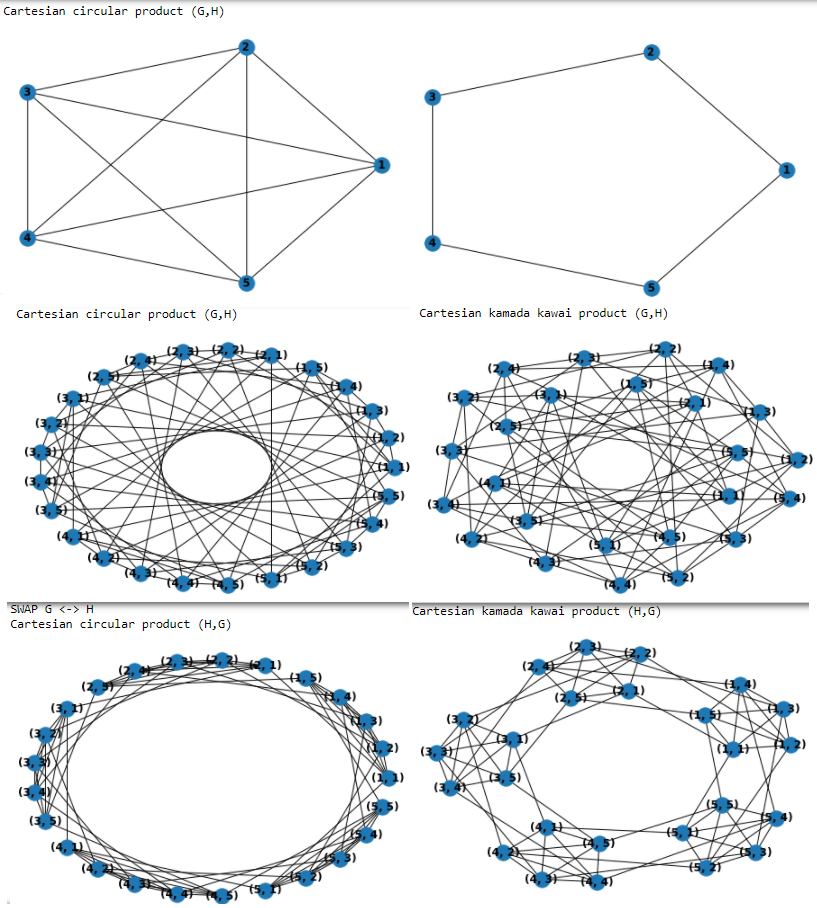

# Circulant-graphs
This work presents examples of algorithms for generating circular and Paley graphs using the python language.

When talking about graphs of this kind, we are talking about their signature of the form C(N, s1, s2, ..., sn), where 
        C is the notation of the circulator; 
        N is the number of graph vertices; 
        s1, s2, ..., sn are generators of the graph, that is, these numbers define an edge connecting the vertices x and x + s1, x + s2, ..., x + sn.
This is how we have defined the graph.

Script С_ (N, s1, s2) generates a graph with N vertices and two generators. As a result of the script's work, we have 2 csv files of the format required for further integration into Gephi software: a file with vertex designations and a file with designations and vertices that they connect.

Example:
In the Example folder you can see the files describing the graph C (9,2,3). The result of integrating this data into Gephi after the necessary reduction to the required visual form, namely the circulant, is shown in the figure below.
/C(9,2,3).png "Описание будет тут")

# Paley graphs
Next, let's talk about Payley graphs.
The Paley graph folder contains the QR (N) and QR_family (k,p) scripts.
QR (N) generates 1 graph on N vertices, and the generation structure differs from the structure in the C_ (N, s1, s2) script. Here now we are not limited to the number of generators. This is convenient from the definition of Paley graphs.
QR_family (k,p) generates a family of graphs with prime numbers ranging from k to P.

The QR (N) and QR_1 (N) scripts have a similar structure and are similar, the difference is that QR_1 (N) is written to a previously created QR folder, where the graphs are placed.

Examples of graph data generation results can be seen in the Paley graph / Examples folder.

# Graph_parameters
This scripts describes all the necessary parameters of the graph to identify the best of them in the context of this task, namely: N - the number of vertices, s - the list of generators, Edge_number - the number of edges, Complete_edges - the number of vertices of the complete graph on N vertices, Density - graph density (the ratio of the number of vertices of a given graph to the number of vertices of the complete graph), Density_rnd - the rounded density value, Diameter, Avg_length - average path length in the graph.

# Graph_parameters_to_csv
This script describes the implementation of the generation of parameters of the Paley graph family and their recording into a csv file.

# Graph_bisection
This script describes the implementation of counting the bisection of a graph, as well as visualization of the original and divided into 2 graphs.
Bisection_paley script describes bisection result only for Paley graphs. Example: bisection_paley(7).
Bisection script describes bisection result for all graphs. It is necessary to enter the number of vertices and the sheet of generators. Example: bisection(7, [1,3]).
/Graph_bisection_N=7.png "Описание будет тут")

# Cartesian_product
Cartesian product G×H is the graph with vertex set V_G×V_H. The vertex set of the graph Cartesian is the Cartesian product of the vertex sets of the two graphs: V_{G×H} =V_G ​ ×V_H. This means that the Cartesian product of a graph has n_{G}n_{H} vertices.

# Graph_drawing
This script allows you to draw a circulant graph by the number of vertices and a given sheet of generators.
Example: Circulant(7, [1,2,3]).
